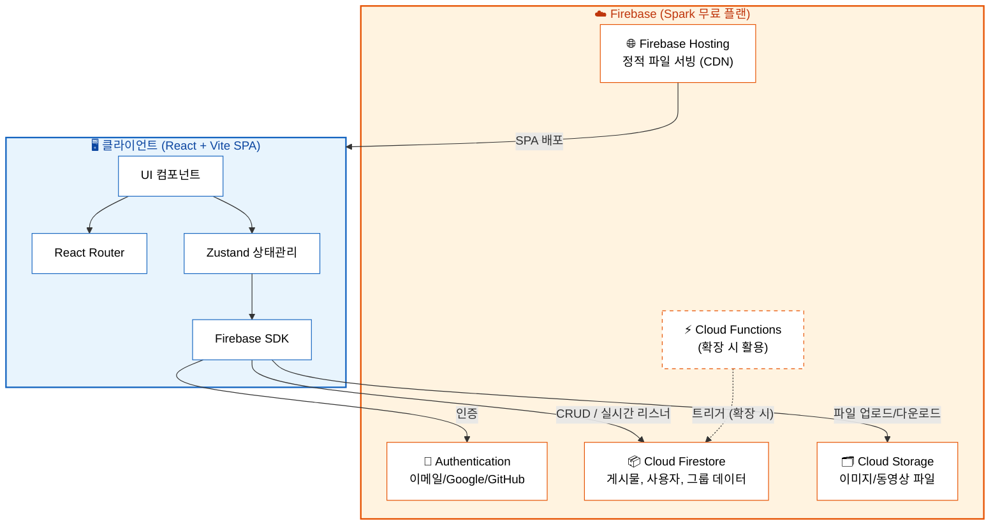
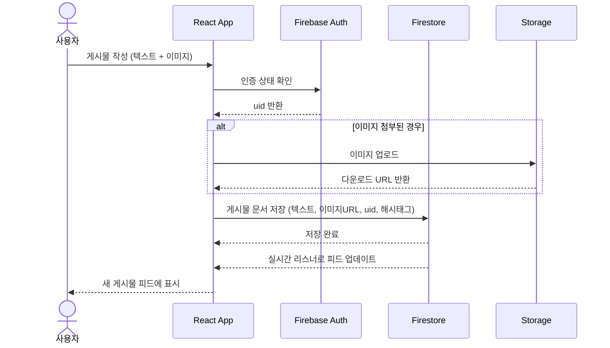
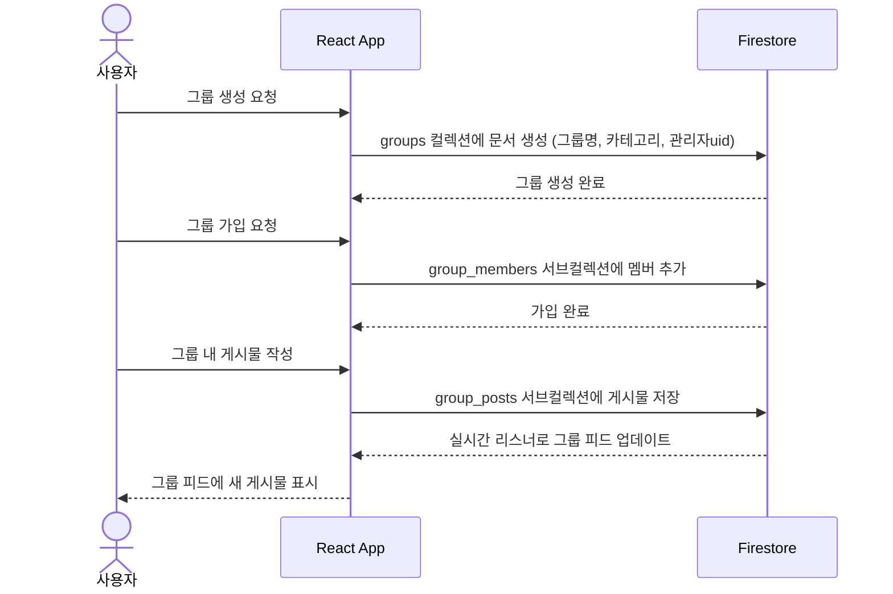

# TechPulse - 하이레벨 아키텍처 (HLD)

## 1. 설계 전제 조건

| 항목 | 내용 |
|------|------|
| 사용자 규모 | 소규모 100명 이내 |
| 배포 비용 | 무료 (Firebase Spark 플랜) |
| 플랫폼 | 웹 기반 반응형 (모바일/데스크톱) |
| MVP 범위 | 사용자 계정/프로필, 포스팅/콘텐츠 공유, 그룹/커뮤니티 |
| 확장 계획 | 팔로우, 피드, 반응, DM, 탐색/트렌딩, 알림은 점진적 추가 |

## 2. 기술 스택 선정

### 프론트엔드

| 기술 | 선택 | 근거 |
|------|------|------|
| 프레임워크 | **React 18** | 컴포넌트 기반 구조, 풍부한 생태계, 마크다운/코드 하이라이팅 라이브러리 풍부 |
| 빌드 도구 | **Vite** | 빠른 HMR, 간결한 설정, CRA 대비 빌드 속도 10배 이상 |
| 라우팅 | **React Router v6** | SPA 라우팅 표준, 중첩 라우트 지원 |
| 상태 관리 | **Zustand** | 가볍고 직관적, Redux 대비 보일러플레이트 최소 (소규모 프로젝트에 적합) |
| 스타일링 | **CSS Modules** | 컴포넌트 스코프 CSS, 추가 의존성 불필요, Vite 기본 지원 |
| 마크다운 | **react-markdown + remark-gfm** | GitHub Flavored 마크다운 렌더링 |
| 코드 하이라이팅 | **Prism.js (react-syntax-highlighter)** | 경량, 다양한 언어 지원 |

### 백엔드 (BaaS)

| 기술 | 선택 | 근거 |
|------|------|------|
| 인증 | **Firebase Authentication** | 이메일/Google/GitHub 소셜 로그인, 무료 무제한 |
| 데이터베이스 | **Cloud Firestore** | 실시간 리스너, NoSQL 유연성, Spark 무료 1GB |
| 파일 저장소 | **Firebase Storage** | 이미지/동영상 업로드, Spark 무료 5GB |
| 호스팅 | **Firebase Hosting** | SSL 자동, CDN, Spark 무료 10GB |
| 서버리스 함수 | **Cloud Functions (확장 시)** | OG태그 파싱, 트렌딩 집계 등 서버 로직 필요 시 활용 |

### Trade-off 분석

| 비교 항목 | Firebase (선택) | Supabase | 자체 서버 (Node.js) |
|-----------|----------------|----------|---------------------|
| 비용 | ✅ 무료 플랜 충분 | ✅ 무료 플랜 있음 | ❌ 호스팅 비용 발생 |
| 실시간 동기화 | ✅ 기본 내장 | ✅ 지원 | ⚠️ 직접 구현 필요 |
| 인증 | ✅ 다양한 소셜 로그인 | ✅ 지원 | ⚠️ 직접 구현 |
| 학습 곡선 | ✅ 풍부한 문서 | ⚠️ 상대적 적음 | ❌ 높음 |
| 확장성 | ⚠️ Blaze 유료 전환 시 제한 없음 | ⚠️ Pro 전환 필요 | ✅ 자유로움 |
| 결론 | **소규모 MVP에 최적** | 대안으로 가능 | 현 단계에서 과도 |

## 3. 시스템 아키텍처 다이어그램

## 4. 핵심 데이터 흐름

### 4.1 게시물 작성 흐름

### 4.2 그룹 활동 흐름

## 5. MVP vs 확장 로드맵

### Phase 1: MVP (즉시 구현)
| 기능 | 세부 내용 |
|------|-----------|
| 사용자 계정 및 프로필 | 회원가입/로그인, 프로필 설정 (관심분야, 기술스택, 소개) |
| 포스팅 및 콘텐츠 공유 | 텍스트/이미지 게시물, 마크다운, 코드 하이라이팅, 해시태그 |
| 그룹 및 커뮤니티 | 그룹 생성/가입/탈퇴, 그룹 전용 포스팅, 지역 선택 |

### Phase 2: 소셜 기능 확장
| 기능 | 세부 내용 |
|------|-----------|
| 팔로우 및 소셜 관계 | 팔로우/언팔로우, 목록 확인 |
| 게시물 반응 및 확산 | 댓글, 좋아요, 리포스트, 북마크 |
| 피드 및 타임라인 | 메인 피드, 최신순/추천순, 무한 스크롤 |

### Phase 3: 커뮤니케이션 확장
| 기능 | 세부 내용 |
|------|-----------|
| 다이렉트 메시지 | 1:1 DM, 그룹 DM |
| 알림 | 인앱 알림, 유형별 알림 설정 |
| 탐색 및 트렌딩 | 검색, 트렌딩 토픽, 추천 (Cloud Functions 활용) |

## 6. Firebase Spark 무료 플랜 한도 확인 (100명 규모)

| 리소스 | Spark 무료 한도 | 100명 예상 사용량 | 여유 |
|--------|----------------|-------------------|------|
| Firestore 저장 | 1 GB | ~50 MB | ✅ 충분 |
| Firestore 읽기 | 50,000회/일 | ~10,000회/일 | ✅ 충분 |
| Firestore 쓰기 | 20,000회/일 | ~2,000회/일 | ✅ 충분 |
| Storage | 5 GB | ~1 GB | ✅ 충분 |
| Hosting 전송 | 360 MB/일 | ~100 MB/일 | ✅ 충분 |
| Auth | 무제한 | 100명 | ✅ 무제한 |
