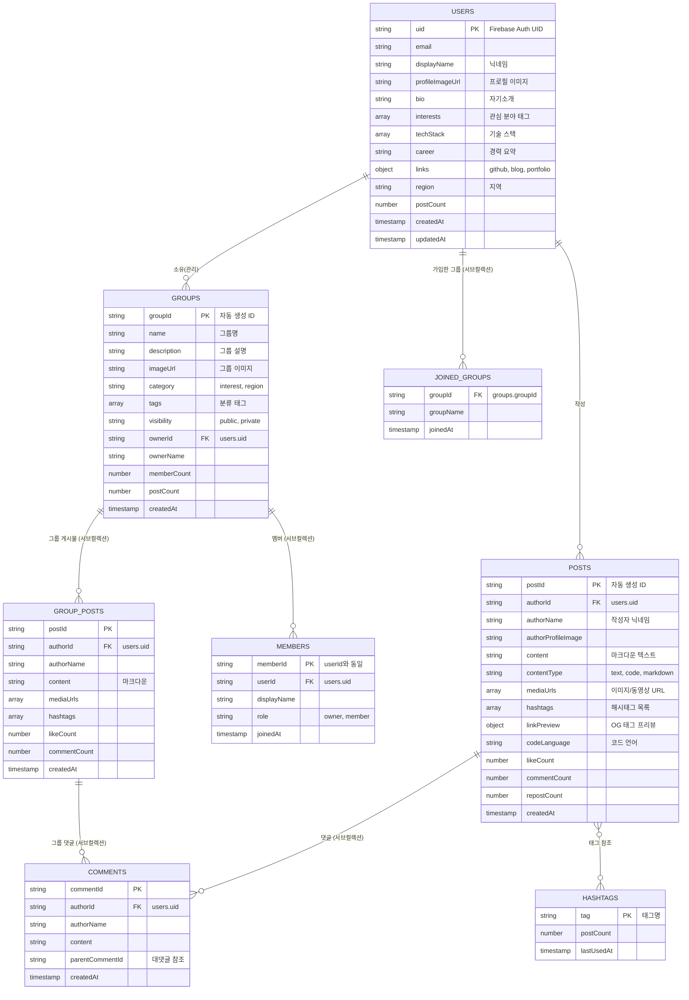
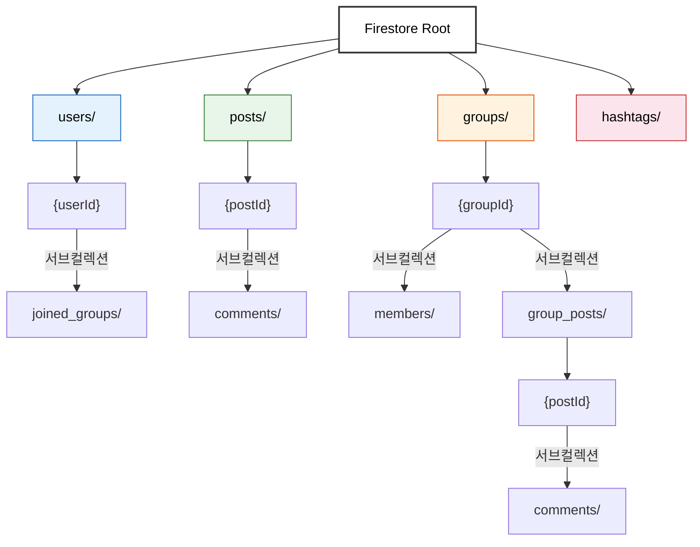

# TechPulse - 로우레벨 설계 (LLD): DB 및 API 스키마

## 1. 데이터 ER 다이어그램

> Firestore는 NoSQL이지만, 컬렉션 간 참조 관계를 ER 다이어그램으로 시각화합니다.



---

## 2. Firestore 컬렉션/도큐먼트 구조

### 전체 구조 개요



---

### 2.1 `users` 컬렉션 — 사용자 프로필

```json
// users/{userId}
{
  "uid": "string (Firebase Auth UID)",
  "email": "string",
  "displayName": "string (닉네임)",
  "profileImageUrl": "string | null",
  "bio": "string (자기소개, 최대 200자)",
  "interests": ["AI", "Backend", "Frontend", "Data"],
  "techStack": ["Python", "React", "TypeScript"],
  "career": "string (경력 요약)",
  "links": {
    "github": "string | null",
    "blog": "string | null",
    "portfolio": "string | null"
  },
  "region": "string | null (지역 선택값)",
  "postCount": "number",
  "createdAt": "timestamp",
  "updatedAt": "timestamp"
}
```

**서브컬렉션:**

```json
// users/{userId}/joined_groups/{groupId}
{
  "groupId": "string",
  "groupName": "string",
  "joinedAt": "timestamp"
}
```

---

### 2.2 `posts` 컬렉션 — 공개 게시물

```json
// posts/{postId}
{
  "authorId": "string (userId)",
  "authorName": "string",
  "authorProfileImage": "string | null",
  "content": "string (마크다운 텍스트)",
  "contentType": "text | code | markdown",
  "mediaUrls": ["string (이미지/동영상 URL)"],
  "mediaTypes": ["image | video"],
  "hashtags": ["#AI", "#Python"],
  "linkPreview": {
    "url": "string | null",
    "title": "string | null",
    "description": "string | null",
    "imageUrl": "string | null"
  },
  "codeLanguage": "string | null (코드 하이라이팅용 언어)",
  "likeCount": "number (기본값 0)",
  "commentCount": "number (기본값 0)",
  "repostCount": "number (기본값 0)",
  "createdAt": "timestamp",
  "updatedAt": "timestamp"
}
```

**서브컬렉션:**

```json
// posts/{postId}/comments/{commentId}
{
  "authorId": "string",
  "authorName": "string",
  "authorProfileImage": "string | null",
  "content": "string",
  "parentCommentId": "string | null (대댓글인 경우)",
  "createdAt": "timestamp"
}
```

---

### 2.3 `groups` 컬렉션 — 그룹/커뮤니티

```json
// groups/{groupId}
{
  "name": "string (그룹명)",
  "description": "string (그룹 설명)",
  "imageUrl": "string | null",
  "category": "interest | region (관심 분야 또는 지역)",
  "tags": ["AI", "LLM", "서울"],
  "visibility": "public | private",
  "ownerId": "string (관리자 userId)",
  "ownerName": "string",
  "memberCount": "number",
  "postCount": "number",
  "createdAt": "timestamp",
  "updatedAt": "timestamp"
}
```

**서브컬렉션:**

```json
// groups/{groupId}/members/{userId}
{
  "userId": "string",
  "displayName": "string",
  "profileImageUrl": "string | null",
  "role": "owner | member",
  "joinedAt": "timestamp"
}
```

```json
// groups/{groupId}/group_posts/{postId}
{
  "authorId": "string",
  "authorName": "string",
  "authorProfileImage": "string | null",
  "content": "string (마크다운)",
  "mediaUrls": ["string"],
  "hashtags": ["string"],
  "likeCount": "number",
  "commentCount": "number",
  "createdAt": "timestamp",
  "updatedAt": "timestamp"
}
```

```json
// groups/{groupId}/group_posts/{postId}/comments/{commentId}
{
  "authorId": "string",
  "authorName": "string",
  "content": "string",
  "createdAt": "timestamp"
}
```

---

### 2.4 `hashtags` 컬렉션 — 해시태그 인덱스 (확장 시)

```json
// hashtags/{tagName}
{
  "tag": "string",
  "postCount": "number",
  "lastUsedAt": "timestamp"
}
```

---

## 3. Firestore Security Rules

```javascript
rules_version = '2';
service cloud.firestore {
  match /databases/{database}/documents {

    // ===== 공통 헬퍼 함수 =====
    function isSignedIn() {
      return request.auth != null;
    }

    function isOwner(userId) {
      return request.auth.uid == userId;
    }

    // ===== users 컬렉션 =====
    match /users/{userId} {
      // 누구나 프로필 읽기 가능
      allow read: if true;
      // 본인만 자기 프로필 생성/수정 가능
      allow create: if isSignedIn() && isOwner(userId);
      allow update: if isSignedIn() && isOwner(userId);
      allow delete: if false;

      // joined_groups 서브컬렉션
      match /joined_groups/{groupId} {
        allow read: if isSignedIn();
        allow write: if isSignedIn() && isOwner(userId);
      }
    }

    // ===== posts 컬렉션 =====
    match /posts/{postId} {
      // 누구나 읽기 가능
      allow read: if true;
      // 로그인한 사용자만 작성 가능
      allow create: if isSignedIn()
        && request.resource.data.authorId == request.auth.uid;
      // 작성자만 수정/삭제 가능
      allow update, delete: if isSignedIn()
        && resource.data.authorId == request.auth.uid;

      // comments 서브컬렉션
      match /comments/{commentId} {
        allow read: if true;
        allow create: if isSignedIn();
        allow update, delete: if isSignedIn()
          && resource.data.authorId == request.auth.uid;
      }
    }

    // ===== groups 컬렉션 =====
    match /groups/{groupId} {
      // 누구나 공개 그룹 읽기 가능
      allow read: if true;
      // 로그인한 사용자만 그룹 생성 가능
      allow create: if isSignedIn();
      // 그룹 소유자만 수정/삭제 가능
      allow update, delete: if isSignedIn()
        && resource.data.ownerId == request.auth.uid;

      // members 서브컬렉션
      match /members/{memberId} {
        allow read: if isSignedIn();
        // 본인이 가입/탈퇴하거나, 그룹 소유자가 관리
        allow create: if isSignedIn()
          && (memberId == request.auth.uid
              || get(/databases/$(database)/documents/groups/$(groupId)).data.ownerId == request.auth.uid);
        allow delete: if isSignedIn()
          && (memberId == request.auth.uid
              || get(/databases/$(database)/documents/groups/$(groupId)).data.ownerId == request.auth.uid);
      }

      // group_posts 서브컬렉션 (멤버만 읽기/쓰기)
      match /group_posts/{postId} {
        allow read: if isSignedIn()
          && exists(/databases/$(database)/documents/groups/$(groupId)/members/$(request.auth.uid));
        allow create: if isSignedIn()
          && exists(/databases/$(database)/documents/groups/$(groupId)/members/$(request.auth.uid))
          && request.resource.data.authorId == request.auth.uid;
        allow update, delete: if isSignedIn()
          && resource.data.authorId == request.auth.uid;

        // group_posts 댓글
        match /comments/{commentId} {
          allow read: if isSignedIn()
            && exists(/databases/$(database)/documents/groups/$(groupId)/members/$(request.auth.uid));
          allow create: if isSignedIn()
            && exists(/databases/$(database)/documents/groups/$(groupId)/members/$(request.auth.uid));
          allow update, delete: if isSignedIn()
            && resource.data.authorId == request.auth.uid;
        }
      }
    }

    // ===== hashtags 컬렉션 =====
    match /hashtags/{tagName} {
      allow read: if true;
      allow write: if isSignedIn();
    }
  }
}
```

---

## 4. 주요 Firestore 쿼리 패턴

Firebase SDK를 직접 호출하는 구조이므로, REST API 대신 주요 쿼리 패턴을 정의합니다.

### 4.1 사용자 관련

| 쿼리 | Firestore 호출 패턴 |
|------|---------------------|
| 프로필 조회 | `doc('users', userId)` |
| 프로필 생성 | `setDoc(doc('users', userId), profileData)` |
| 프로필 수정 | `updateDoc(doc('users', userId), updatedFields)` |
| 닉네임 중복 확인 | `query(collection('users'), where('displayName', '==', name), limit(1))` |

### 4.2 게시물 관련

| 쿼리 | Firestore 호출 패턴 |
|------|---------------------|
| 공개 게시물 목록 (최신순) | `query(collection('posts'), orderBy('createdAt', 'desc'), limit(20))` |
| 해시태그 검색 | `query(collection('posts'), where('hashtags', 'array-contains', '#AI'), orderBy('createdAt', 'desc'))` |
| 게시물 작성 | `addDoc(collection('posts'), postData)` |
| 게시물 수정 | `updateDoc(doc('posts', postId), updatedFields)` |
| 게시물 삭제 | `deleteDoc(doc('posts', postId))` |
| 댓글 목록 | `query(collection('posts', postId, 'comments'), orderBy('createdAt', 'asc'))` |
| 댓글 작성 | `addDoc(collection('posts', postId, 'comments'), commentData)` |
| 피드 실시간 구독 | `onSnapshot(query(collection('posts'), orderBy('createdAt', 'desc'), limit(20)))` |
| 무한 스크롤 | `query(..., startAfter(lastDoc), limit(20))` |

### 4.3 그룹 관련

| 쿼리 | Firestore 호출 패턴 |
|------|---------------------|
| 공개 그룹 목록 | `query(collection('groups'), where('visibility', '==', 'public'), orderBy('memberCount', 'desc'))` |
| 카테고리 필터 | `query(collection('groups'), where('tags', 'array-contains', 'AI'))` |
| 지역 기반 검색 | `query(collection('groups'), where('category', '==', 'region'), where('tags', 'array-contains', '서울'))` |
| 그룹 생성 | `addDoc(collection('groups'), groupData)` |
| 멤버 가입 | `setDoc(doc('groups', groupId, 'members', userId), memberData)` + `updateDoc(doc('groups', groupId), {memberCount: increment(1)})` |
| 멤버 탈퇴 | `deleteDoc(doc('groups', groupId, 'members', userId))` + `updateDoc(doc('groups', groupId), {memberCount: increment(-1)})` |
| 그룹 게시물 목록 | `query(collection('groups', groupId, 'group_posts'), orderBy('createdAt', 'desc'), limit(20))` |
| 그룹 게시물 실시간 구독 | `onSnapshot(query(collection('groups', groupId, 'group_posts'), ...))` |
| 내가 가입한 그룹 | `query(collection('users', userId, 'joined_groups'), orderBy('joinedAt', 'desc'))` |

---

## 5. 필요 Firestore 인덱스 (복합 인덱스)

| 컬렉션 | 필드 조합 | 용도 |
|--------|-----------|------|
| `posts` | `hashtags` (Array) + `createdAt` (desc) | 해시태그 검색 + 최신순 정렬 |
| `groups` | `visibility` + `memberCount` (desc) | 공개 그룹 인기순 정렬 |
| `groups` | `category` + `tags` (Array) | 카테고리 + 태그 필터링 |
| `groups/{id}/group_posts` | `createdAt` (desc) | 그룹 내 게시물 최신순 |

---

## 6. Firebase Storage 파일 구조

```
storage/
├── users/
│   └── {userId}/
│       └── profile.jpg                    # 프로필 이미지
├── posts/
│   └── {postId}/
│       ├── image_0.jpg                    # 게시물 이미지
│       ├── image_1.jpg
│       └── video_0.mp4                    # 게시물 동영상
└── groups/
    └── {groupId}/
        ├── cover.jpg                      # 그룹 커버 이미지
        └── posts/
            └── {postId}/
                └── image_0.jpg            # 그룹 게시물 이미지
```

### Storage Security Rules

```javascript
rules_version = '2';
service firebase.storage {
  match /b/{bucket}/o {
    // 프로필 이미지: 본인만 업로드, 모든 사용자 읽기
    match /users/{userId}/{allPaths=**} {
      allow read: if true;
      allow write: if request.auth != null
        && request.auth.uid == userId
        && request.resource.size < 5 * 1024 * 1024      // 5MB 제한
        && request.resource.contentType.matches('image/.*');
    }

    // 게시물 미디어: 로그인 사용자 업로드, 모든 사용자 읽기
    match /posts/{postId}/{allPaths=**} {
      allow read: if true;
      allow write: if request.auth != null
        && request.resource.size < 50 * 1024 * 1024     // 50MB 제한 (동영상 포함)
        && (request.resource.contentType.matches('image/.*')
            || request.resource.contentType.matches('video/.*'));
    }

    // 그룹 미디어: 로그인 사용자 업로드, 모든 사용자 읽기
    match /groups/{groupId}/{allPaths=**} {
      allow read: if true;
      allow write: if request.auth != null
        && request.resource.size < 50 * 1024 * 1024;
    }
  }
}
```
