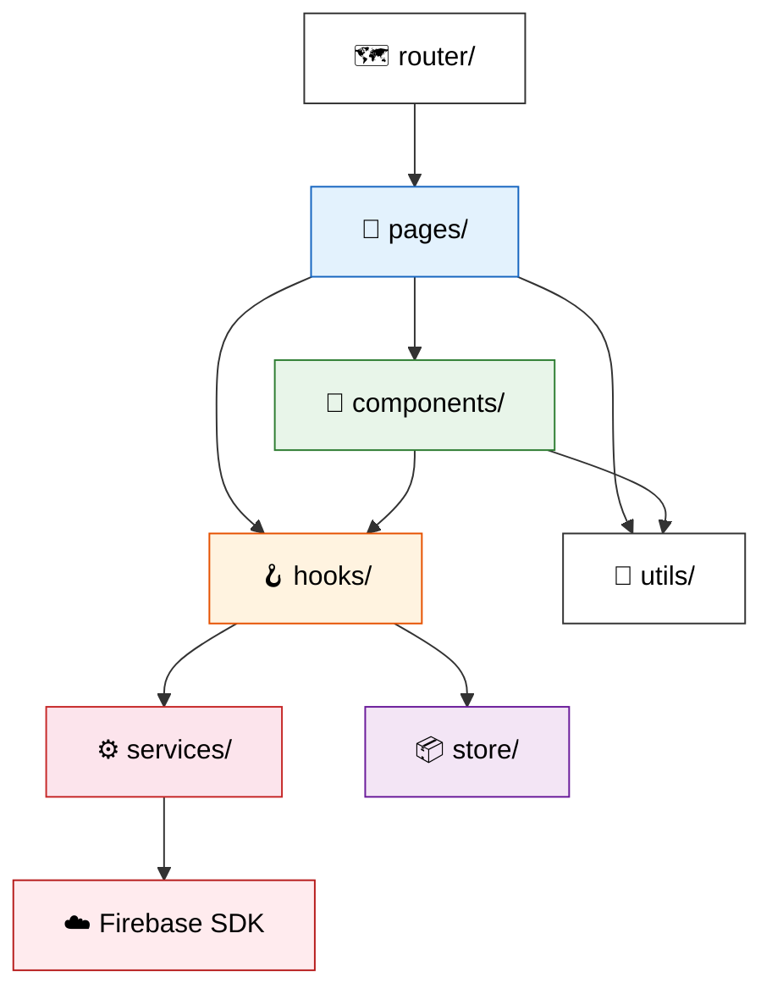

# TechPulse - 디렉터리 구조 및 모듈 설계

## 1. 프로젝트 디렉터리 구조

```
techpulse/
├── public/
│   ├── favicon.ico
│   └── index.html
├── src/
│   ├── assets/                     # 정적 리소스
│   │   ├── images/
│   │   └── fonts/
│   │
│   ├── components/                 # 공통 재사용 컴포넌트
│   │   ├── common/
│   │   │   ├── LoadingSpinner.jsx
│   │   │   ├── LoadingSpinner.module.css
│   │   │   ├── EmptyState.jsx
│   │   │   ├── Modal.jsx
│   │   │   ├── TagChip.jsx
│   │   │   └── InfiniteScroll.jsx
│   │   ├── layout/
│   │   │   ├── TopNavBar.jsx
│   │   │   ├── TopNavBar.module.css
│   │   │   ├── BottomNavBar.jsx
│   │   │   ├── BottomNavBar.module.css
│   │   │   ├── SideNav.jsx
│   │   │   └── MainLayout.jsx
│   │   ├── post/
│   │   │   ├── PostCard.jsx
│   │   │   ├── PostCard.module.css
│   │   │   ├── CommentItem.jsx
│   │   │   └── MarkdownRenderer.jsx
│   │   ├── group/
│   │   │   ├── GroupCard.jsx
│   │   │   └── GroupCard.module.css
│   │   ├── user/
│   │   │   ├── UserProfileCard.jsx
│   │   │   └── UserProfileCard.module.css
│   │   └── media/
│   │       └── MediaUploader.jsx
│   │
│   ├── pages/                      # 화면(라우트) 컴포넌트
│   │   ├── auth/
│   │   │   ├── LoginPage.jsx       # SCR-001
│   │   │   ├── LoginPage.module.css
│   │   │   ├── SignupPage.jsx      # SCR-002
│   │   │   └── SignupPage.module.css
│   │   ├── profile/
│   │   │   ├── ProfileEditPage.jsx # SCR-003
│   │   │   ├── ProfilePage.jsx     # SCR-004
│   │   │   └── ProfilePage.module.css
│   │   ├── feed/
│   │   │   ├── FeedPage.jsx        # SCR-005
│   │   │   ├── FeedPage.module.css
│   │   │   ├── CreatePostModal.jsx # SCR-006
│   │   │   └── PostDetailPage.jsx  # SCR-007
│   │   └── group/
│   │       ├── GroupListPage.jsx    # SCR-008
│   │       ├── GroupDetailPage.jsx  # SCR-009
│   │       ├── GroupCreatePage.jsx  # SCR-010
│   │       └── GroupPage.module.css
│   │
│   ├── hooks/                      # 커스텀 훅
│   │   ├── useAuth.js              # 인증 상태 관리
│   │   ├── usePosts.js             # 게시물 CRUD
│   │   ├── useGroups.js            # 그룹 CRUD
│   │   ├── useComments.js          # 댓글 CRUD
│   │   ├── useInfiniteQuery.js     # 무한 스크롤 쿼리
│   │   └── useMediaUpload.js       # 미디어 업로드
│   │
│   ├── services/                   # Firebase 서비스 래퍼
│   │   ├── firebase.js             # Firebase 초기화 및 인스턴스 export
│   │   ├── authService.js          # Authentication API
│   │   ├── postService.js          # 게시물 Firestore CRUD
│   │   ├── groupService.js         # 그룹 Firestore CRUD
│   │   ├── commentService.js       # 댓글 Firestore CRUD
│   │   ├── userService.js          # 사용자 프로필 Firestore CRUD
│   │   └── storageService.js       # Storage 파일 업로드/삭제
│   │
│   ├── store/                      # Zustand 상태 관리
│   │   ├── authStore.js            # 인증 상태 (user, isLoggedIn)
│   │   ├── feedStore.js            # 피드 상태 (posts, filters)
│   │   └── uiStore.js              # UI 상태 (모달, 토스트, 테마)
│   │
│   ├── utils/                      # 유틸리티 함수
│   │   ├── formatDate.js           # 날짜/시간 포맷팅
│   │   ├── validators.js           # 입력값 유효성 검증
│   │   ├── constants.js            # 상수 정의 (태그 목록, 지역 목록 등)
│   │   └── sanitize.js             # DOMPurify 마크다운 살균
│   │
│   ├── router/                     # 라우팅
│   │   ├── AppRouter.jsx           # React Router 설정
│   │   └── ProtectedRoute.jsx      # 인증 가드
│   │
│   ├── styles/                     # 글로벌 스타일
│   │   ├── global.css              # CSS 리셋, 변수, 글로벌 스타일
│   │   └── variables.css           # CSS Custom Properties (색상, 폰트 등)
│   │
│   ├── App.jsx                     # 앱 루트 컴포넌트
│   └── main.jsx                    # 엔트리 포인트
│
├── .github/
│   └── workflows/
│       └── deploy.yml              # CI/CD 파이프라인
│
├── doc/                            # 프로젝트 문서
│   ├── requirements/
│   └── design/
│
├── .env.example                    # 환경 변수 템플릿
├── .gitignore
├── .eslintrc.cjs                   # ESLint 설정
├── .prettierrc                     # Prettier 설정
├── firebase.json                   # Firebase Hosting 설정
├── firestore.rules                 # Firestore Security Rules
├── storage.rules                   # Storage Security Rules
├── package.json
├── vite.config.js
└── README.md
```

---

## 2. 모듈 의존성 관계



### 의존성 규칙 (Import 방향)

| 계층 | 참조 가능 | 참조 불가 |
|------|-----------|-----------|
| `pages/` | components, hooks, utils, store | services (직접 호출 금지) |
| `components/` | hooks, utils | pages, services, store |
| `hooks/` | services, store, utils | pages, components |
| `services/` | Firebase SDK, utils | pages, components, hooks, store |
| `store/` | utils | pages, components, hooks, services |
| `utils/` | 없음 (순수 함수) | 모든 모듈 |

> **핵심 원칙**: `pages/` → `hooks/` → `services/` → `Firebase SDK` 단방향 흐름 유지

---

## 3. 주요 모듈 역할

### 3.1 `services/` — Firebase 서비스 래퍼

Firebase SDK 호출을 캡슐화하여 비즈니스 로직과 분리합니다.

```javascript
// services/postService.js (예시)
import { db } from './firebase';
import {
  collection, addDoc, query, orderBy, limit,
  startAfter, onSnapshot, doc, updateDoc, deleteDoc
} from 'firebase/firestore';

export const postService = {
  // 게시물 생성
  createPost: (postData) => addDoc(collection(db, 'posts'), postData),

  // 게시물 목록 쿼리 (페이지네이션)
  getPostsQuery: (lastDoc = null, pageSize = 20) => {
    const baseQuery = query(
      collection(db, 'posts'),
      orderBy('createdAt', 'desc'),
      limit(pageSize)
    );
    return lastDoc ? query(baseQuery, startAfter(lastDoc)) : baseQuery;
  },

  // 실시간 리스너
  subscribePosts: (callback, pageSize = 20) => {
    const q = query(collection(db, 'posts'), orderBy('createdAt', 'desc'), limit(pageSize));
    return onSnapshot(q, callback);
  },
};
```

### 3.2 `hooks/` — 커스텀 훅

서비스와 상태를 연결하는 중간 계층입니다.

```javascript
// hooks/usePosts.js (예시)
import { useState, useEffect } from 'react';
import { postService } from '../services/postService';

export function usePosts() {
  const [posts, setPosts] = useState([]);
  const [loading, setLoading] = useState(true);

  useEffect(() => {
    const unsubscribe = postService.subscribePosts((snapshot) => {
      const data = snapshot.docs.map(doc => ({ id: doc.id, ...doc.data() }));
      setPosts(data);
      setLoading(false);
    });
    return () => unsubscribe();
  }, []);

  return { posts, loading };
}
```

### 3.3 `store/` — Zustand 상태 관리

전역 상태(인증, UI)만 Zustand로 관리하고, 서버 데이터는 hooks에서 처리합니다.

```javascript
// store/authStore.js (예시)
import { create } from 'zustand';

export const useAuthStore = create((set) => ({
  user: null,
  isLoggedIn: false,
  setUser: (user) => set({ user, isLoggedIn: !!user }),
  clearUser: () => set({ user: null, isLoggedIn: false }),
}));
```

---

## 4. 라우팅 설계

```javascript
// router/AppRouter.jsx (예시 구조)
const routes = [
  // 공개 라우트
  { path: '/login',          element: <LoginPage /> },
  { path: '/signup',         element: <SignupPage /> },

  // 인증 필요 라우트
  { path: '/',               element: <ProtectedRoute><FeedPage /></ProtectedRoute> },
  { path: '/profile/edit',   element: <ProtectedRoute><ProfileEditPage /></ProtectedRoute> },
  { path: '/profile/:userId', element: <ProtectedRoute><ProfilePage /></ProtectedRoute> },
  { path: '/post/:postId',   element: <ProtectedRoute><PostDetailPage /></ProtectedRoute> },
  { path: '/groups',         element: <ProtectedRoute><GroupListPage /></ProtectedRoute> },
  { path: '/groups/create',  element: <ProtectedRoute><GroupCreatePage /></ProtectedRoute> },
  { path: '/groups/:groupId', element: <ProtectedRoute><GroupDetailPage /></ProtectedRoute> },

  // 404
  { path: '*',               element: <NotFoundPage /> },
];
```

---

## 5. 코드 컨벤션 및 네이밍 규칙

### 5.1 파일 네이밍

| 유형 | 규칙 | 예시 |
|------|------|------|
| React 컴포넌트 | PascalCase + `.jsx` | `PostCard.jsx` |
| CSS 모듈 | 컴포넌트명 + `.module.css` | `PostCard.module.css` |
| 커스텀 훅 | `use` + PascalCase + `.js` | `usePosts.js` |
| 서비스 | camelCase + `Service.js` | `postService.js` |
| Zustand 스토어 | camelCase + `Store.js` | `authStore.js` |
| 유틸리티 | camelCase + `.js` | `formatDate.js` |

### 5.2 컴포넌트 구조

```javascript
// 컴포넌트 파일 표준 구조
import styles from './ComponentName.module.css';  // 1. 스타일 import
import { useState } from 'react';                 // 2. React import
import { useAuth } from '../../hooks/useAuth';     // 3. 커스텀 훅 import
import TagChip from '../common/TagChip';           // 4. 컴포넌트 import

export default function ComponentName({ prop1, prop2 }) {
  // 5. 훅 호출
  // 6. 상태 정의
  // 7. 이벤트 핸들러
  // 8. JSX 반환
}
```

### 5.3 CSS 네이밍

| 항목 | 규칙 |
|------|------|
| CSS 모듈 클래스 | camelCase (`styles.postCard`, `styles.headerTitle`) |
| CSS Custom Properties | `--color-primary`, `--font-size-lg`, `--spacing-md` |
| 브레이크포인트 변수 | `--breakpoint-mobile`, `--breakpoint-tablet` |

### 5.4 Git 커밋 메시지

```
<type>(<scope>): <subject>

type: feat, fix, docs, style, refactor, test, chore
scope: auth, post, group, feed, ui, config

예시:
feat(post): 게시물 작성 모달 구현
fix(auth): 소셜 로그인 리다이렉트 오류 수정
docs(design): HLD 아키텍처 다이어그램 추가
```

---

## 6. 주요 npm 패키지

| 패키지 | 버전 | 용도 |
|--------|------|------|
| `react` | ^18.x | UI 프레임워크 |
| `react-dom` | ^18.x | DOM 렌더링 |
| `react-router-dom` | ^6.x | SPA 라우팅 |
| `zustand` | ^4.x | 전역 상태 관리 |
| `firebase` | ^10.x | Firebase SDK |
| `react-markdown` | ^9.x | 마크다운 렌더링 |
| `remark-gfm` | ^4.x | GitHub Flavored Markdown |
| `react-syntax-highlighter` | ^15.x | 코드 하이라이팅 (Prism.js) |
| `dompurify` | ^3.x | XSS 방지 HTML 살균 |

### Dev Dependencies

| 패키지 | 용도 |
|--------|------|
| `vite` | 빌드 도구 |
| `eslint` | 코드 린팅 |
| `prettier` | 코드 포맷팅 |
| `eslint-plugin-react` | React 린트 규칙 |
