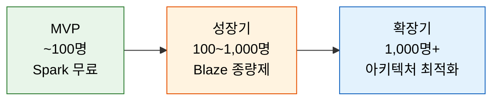
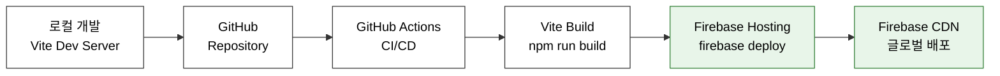

# TechPulse - 비기능적 요구사항 및 인프라 설계 (NFR & Infra)

## 1. 보안 설계

### 1.1 인증 (Authentication)

| 항목 | 설계 |
|------|------|
| **인증 방식** | Firebase Authentication (관리형 서비스) |
| **지원 인증** | 이메일/비밀번호, Google OAuth 2.0, GitHub OAuth |
| **세션 관리** | Firebase Auth SDK 토큰 기반 (자동 갱신) |
| **토큰 유효기간** | ID Token 1시간, Refresh Token 자동 갱신 |
| **비밀번호 정책** | 최소 8자, Firebase Auth 기본 정책 적용 |

### 1.2 인가 (Authorization)

| 계층 | 방식 | 설명 |
|------|------|------|
| **Firestore** | Security Rules | 문서 수준 읽기/쓰기 제어 (`architecture-lld.md` 참조) |
| **Storage** | Security Rules | 파일 업로드 크기 및 타입 제한 |
| **클라이언트** | 라우트 가드 | React Router에서 비로그인 사용자 리다이렉트 |

### 1.3 데이터 보안

| 항목 | 설계 |
|------|------|
| **전송 암호화** | HTTPS 강제 (Firebase Hosting 기본 제공) |
| **저장 암호화** | Firebase Firestore/Storage 서버 측 암호화 (기본 제공) |
| **비밀번호 해싱** | Firebase Auth 내부 처리 (bcrypt/scrypt) |
| **XSS 방지** | React 기본 이스케이프 + DOMPurify (마크다운 렌더링 시) |
| **CORS** | Firebase Hosting 설정으로 허용 도메인 제한 |

### 1.4 개인정보 보호

| 항목 | 설계 |
|------|------|
| **최소 수집 원칙** | 이메일, 닉네임, 프로필 사진만 필수 (나머지 선택) |
| **데이터 삭제** | 회원 탈퇴 시 Firestore 문서 + Storage 파일 일괄 삭제 |
| **접근 로그** | Firebase Auth 로그인 이력 자동 기록 |

---

## 2. 성능 설계

### 2.1 프론트엔드 성능

| 전략 | 구현 방법 | 목표 |
|------|-----------|------|
| **코드 스플리팅** | Vite 기본 동적 import + React.lazy | 초기 번들 < 200KB |
| **트리 쉐이킹** | Vite 프로덕션 빌드 자동 적용 | 미사용 코드 제거 |
| **이미지 최적화** | 업로드 시 리사이즈 (최대 1920px) + WebP 변환 고려 | 이미지 로딩 최소화 |
| **Lazy Loading** | 이미지 `loading="lazy"`, 컴포넌트 지연 로딩 | LCP < 2.5s |
| **캐싱** | Zustand 클라이언트 상태 캐시 + SWR 패턴 | 불필요한 재요청 방지 |

### 2.2 Firestore 성능

| 전략 | 구현 방법 | 효과 |
|------|-----------|------|
| **쿼리 최적화** | 복합 인덱스 사전 생성 (`architecture-lld.md` 참조) | 쿼리 응답 < 500ms |
| **데이터 비정규화** | 게시물에 `authorName`, `authorProfileImage` 중복 저장 | JOIN 없이 단일 쿼리 |
| **페이지네이션** | `limit(20)` + `startAfter` 커서 기반 | 메모리 사용량 제한 |
| **실시간 리스너 최소화** | 현재 보이는 화면의 피드만 `onSnapshot` | 동시 리스너 < 5개 |
| **오프라인 지원** | Firestore 캐시 활성화 (`enablePersistence`) | 네트워크 장애 대응 |

### 2.3 성능 목표 (Core Web Vitals)

| 지표 | 목표 | 비고 |
|------|------|------|
| **LCP** (Largest Contentful Paint) | < 2.5s | 피드 첫 로딩 |
| **FID** (First Input Delay) | < 100ms | 버튼 클릭 응답 |
| **CLS** (Cumulative Layout Shift) | < 0.1 | 이미지 로딩 시 레이아웃 안정 |
| **TTI** (Time to Interactive) | < 3.5s | 피드 인터랙션 가능 시점 |

---

## 3. 확장성 설계

### 3.1 Firebase Spark 무료 플랜 한도 관리

| 서비스 | 무료 한도 | 예상 사용량 (100명 기준) | 여유율 |
|--------|-----------|-------------------------|--------|
| **Firestore 쓰기** | 20K/일 | ~2,000/일 | 10배 |
| **Firestore 읽기** | 50K/일 | ~10,000/일 | 5배 |
| **Firestore 저장** | 1GB | ~200MB (초기) | 5배 |
| **Storage** | 5GB | ~1GB (초기) | 5배 |
| **Hosting 전송** | 10GB/월 | ~2GB/월 | 5배 |
| **Authentication** | 무제한 (이메일/소셜) | 100명 | - |

### 3.2 확장 시나리오



| 단계 | 전환 기준 | 주요 변경사항 |
|------|-----------|---------------|
| **MVP → 성장기** | 무료 한도 70% 도달 시 | Blaze 종량제 전환, Cloud Functions 활용 시작 |
| **성장기 → 확장기** | 1,000명+ | 이미지 CDN(Cloud CDN), 검색 전용 서비스(Algolia) 도입 |

---

## 4. 배포 및 CI/CD

### 4.1 배포 아키텍처



### 4.2 GitHub Actions CI/CD 파이프라인

```yaml
# .github/workflows/deploy.yml (예시)
name: Deploy to Firebase Hosting
on:
  push:
    branches: [main]

jobs:
  build-and-deploy:
    runs-on: ubuntu-latest
    steps:
      - uses: actions/checkout@v4
      - uses: actions/setup-node@v4
        with:
          node-version: 20
          cache: 'npm'
      - run: npm ci
      - run: npm run lint           # ESLint 검사
      - run: npm run build          # Vite 프로덕션 빌드
      - uses: FirebaseExtended/action-hosting-deploy@v0
        with:
          repoToken: ${{ secrets.GITHUB_TOKEN }}
          firebaseServiceAccount: ${{ secrets.FIREBASE_SERVICE_ACCOUNT }}
          channelId: live
```

### 4.3 환경 분리

| 환경 | 용도 | Firebase 프로젝트 | 배포 방법 |
|------|------|-------------------|-----------|
| **Development** | 로컬 개발 | Firebase Emulator Suite | `npm run dev` |
| **Preview** | PR 미리보기 | 동일 프로젝트 (Preview Channel) | GitHub Actions PR 트리거 |
| **Production** | 실 서비스 | 프로덕션 프로젝트 | `main` 브랜치 push 시 자동 배포 |

---

## 5. 모니터링 및 로깅

### 5.1 모니터링 도구

| 도구 | 용도 | 비용 |
|------|------|------|
| **Firebase Console** | Firestore 사용량, Auth 대시보드, Storage 사용량 | 무료 |
| **Firebase Performance Monitoring** | 웹 성능 지표 (LCP, FID, CLS) | 무료 |
| **Firebase Crashlytics** | 프론트엔드 에러 추적 (웹 미지원 → 대안: Sentry 무료) | - |
| **Google Analytics for Firebase** | 사용자 행동 분석, 이벤트 추적 | 무료 |

### 5.2 핵심 모니터링 항목

| 항목 | 수집 방식 | 알림 기준 |
|------|-----------|-----------|
| Firestore 일일 읽기/쓰기 | Firebase Console | 무료 한도 70% 도달 시 |
| Storage 용량 | Firebase Console | 3GB 초과 시 |
| 인증 실패율 | Firebase Auth | 1시간 내 10회 이상 실패 |
| 페이지 로드 시간 | Performance Monitoring | LCP > 4s |

---

## 6. 에러 처리 전략

| 에러 유형 | 처리 방법 |
|-----------|-----------|
| **네트워크 오류** | 재시도 안내 토스트 + Firestore 오프라인 캐시 활용 |
| **인증 만료** | 자동 토큰 갱신, 실패 시 로그인 화면으로 리다이렉트 |
| **Firestore 권한 오류** | 사용자 친화적 에러 메시지 (접근 권한 없음) |
| **Storage 업로드 실패** | 프로그레스 바 + 재시도 버튼 |
| **페이지 미발견 (404)** | 커스텀 404 페이지로 안내 |
| **예기치 못한 오류** | Error Boundary → 폴백 UI + "새로고침" 안내 |
