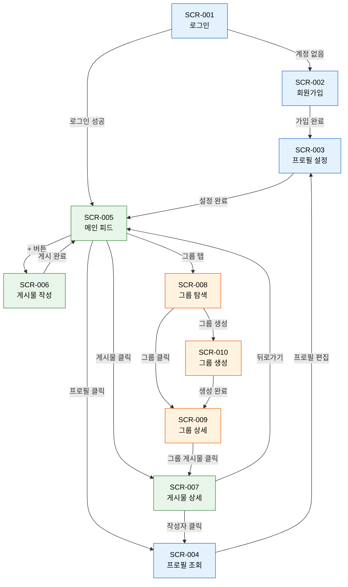

# TechPulse - 화면 설계서 (Screen Design)

## 1. 화면 목록 정의

| 화면 ID | 화면명 | 기능 영역 | MVP | 상세 설계 |
|---------|--------|-----------|-----|-----------|
| SCR-001 | 로그인 화면 | 사용자 계정 | ✅ | [상세](screens/SCR-001-로그인.md) |
| SCR-002 | 회원가입 화면 | 사용자 계정 | ✅ | [상세](screens/SCR-002-회원가입.md) |
| SCR-003 | 프로필 설정 화면 | 사용자 프로필 | ✅ | [상세](screens/SCR-003-프로필설정.md) |
| SCR-004 | 프로필 조회 화면 | 사용자 프로필 | ✅ | [상세](screens/SCR-004-프로필조회.md) |
| SCR-005 | 메인 피드 화면 | 포스팅/피드 | ✅ | [상세](screens/SCR-005-메인피드.md) |
| SCR-006 | 게시물 작성 모달 | 포스팅 | ✅ | [상세](screens/SCR-006-게시물작성.md) |
| SCR-007 | 게시물 상세 화면 | 포스팅 | ✅ | [상세](screens/SCR-007-게시물상세.md) |
| SCR-008 | 그룹 탐색 화면 | 그룹/커뮤니티 | ✅ | [상세](screens/SCR-008-그룹탐색.md) |
| SCR-009 | 그룹 상세 화면 | 그룹/커뮤니티 | ✅ | [상세](screens/SCR-009-그룹상세.md) |
| SCR-010 | 그룹 생성 화면 | 그룹/커뮤니티 | ✅ | [상세](screens/SCR-010-그룹생성.md) |
| SCR-011 | 검색 결과 화면 | 탐색 | Phase 2+ | - |
| SCR-012 | DM 목록 화면 | 다이렉트 메시지 | Phase 3+ | - |
| SCR-013 | 채팅 화면 | 다이렉트 메시지 | Phase 3+ | - |
| SCR-014 | 알림 목록 화면 | 알림 | Phase 3+ | - |
| SCR-015 | 설정 화면 | 사용자 계정 | Phase 3+ | - |

---

## 2. 화면 흐름도 (Screen Flow)

> 🔵 파란색: 계정/프로필 ・ 🟢 초록색: 포스팅/피드 ・ 🟠 주황색: 그룹

---

## 3. 공통 컴포넌트 정의

| 컴포넌트 | 사용 화면 | 설명 |
|----------|-----------|------|
| `TopNavBar` | 모든 화면 | 로고, 검색, 알림, 프로필 아이콘 |
| `BottomNavBar` | 모든 화면 (모바일) | 홈, 피드, 그룹, DM, 프로필 탭 |
| `PostCard` | SCR-004, 005, 007, 009 | 게시물 카드 (작성자, 본문, 미디어, 액션바) |
| `CommentItem` | SCR-007 | 댓글 항목 (프로필, 내용, 시간) |
| `GroupCard` | SCR-008 | 그룹 카드 (이름, 설명, 멤버수, 태그) |
| `UserProfileCard` | SCR-004 | 프로필 헤더 (사진, 이름, 소개, 태그) |
| `TagChip` | SCR-003, 004, 005, 008 | 관심분야/기술스택/해시태그 칩 |
| `MediaUploader` | SCR-003, 006, 010 | 이미지/동영상 업로드 컴포넌트 |
| `MarkdownRenderer` | SCR-005, 007, 009 | 마크다운+코드 하이라이팅 렌더러 |
| `InfiniteScroll` | SCR-004, 005, 008, 009 | 무한 스크롤 래퍼 |
| `Modal` | SCR-006 | 모달 오버레이 |
| `LoadingSpinner` | 모든 화면 | 로딩 인디케이터 |
| `EmptyState` | 피드, 그룹 | 데이터 없을 때 안내 메시지 |

---

## 4. 반응형 설계 고려사항

| 브레이크포인트 | 범위 | 레이아웃 변화 |
|---------------|------|---------------|
| **모바일** | ~767px | 단일 컬럼, 하단 네비게이션 표시, 햄버거 메뉴 |
| **태블릿** | 768~1023px | 2컬럼 (피드 + 사이드바 축소), 하단 네비 유지 |
| **데스크톱** | 1024px~ | 3컬럼 (좌측 네비 + 메인 피드 + 우측 사이드바), 상단 네비 |
