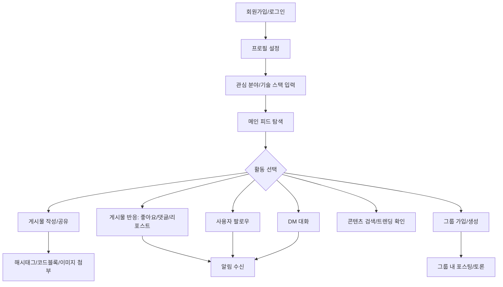

# 프로젝트 개요: TechPulse - AI/IT 지식 공유 SNS

## 1. 프로젝트 정보

| 항목 | 내용 |
|------|------|
| 프로젝트명 | TechPulse (가칭) |
| 프로젝트 유형 | AI/IT 전문 지식 공유 소셜 네트워크 서비스 |
| 벤치마킹 | Twitter(X) |
| 작성일 | 2026-03-16 |

## 2. 프로젝트 배경 및 목적

### 배경
AI와 IT 기술의 빠른 발전 속에서, 전문가와 관심 있는 사람들이 최신 기술 트렌드와 실용적인 팁을 빠르게 공유하고 토론할 수 있는 전용 SNS 플랫폼이 부재합니다. 기존의 범용 SNS(Twitter, Facebook)에서는 기술 콘텐츠가 다른 주제에 묻히기 쉽고, 코드 하이라이팅이나 마크다운 같은 기술 친화적 기능이 부족합니다.

### 목적
- AI/IT에 관심이 많은 사용자들이 **전문적인 기술 지식과 활용 팁**을 효과적으로 공유할 수 있는 플랫폼을 구축합니다.
- 트위터의 **실시간성과 간결한 공유 방식**을 채택하되, **코드 블록, 마크다운, 기술 스택 프로필** 등 기술 커뮤니티에 최적화된 기능을 제공합니다.
- **관심 분야 및 지역 기반의 그룹 활동**을 통해 온·오프라인 네트워킹을 지원합니다.

## 3. 타겟 사용자 프로파일

| 구분 | 설명 |
|------|------|
| 주요 타겟 | AI, IT 분야에 관심이 많은 개발자, 데이터 사이언티스트, 기획자, 학생 등 |
| 연령대 | 20~40대 |
| 특성 | 기술 트렌드에 민감하고, 지식 공유에 적극적이며, 전문 네트워킹을 원하는 사용자 |
| 사용 환경 | 웹 브라우저 (모바일/데스크톱) |

## 4. 핵심 사용자 여정 (User Flow)

## 5. 핵심 기능 요약

| 번호 | 기능 영역 | 주요 기능 | 우선순위 |
|------|-----------|-----------|----------|
| 1 | 사용자 계정 및 프로필 | 회원가입/로그인, 기술 스택 프로필 | 🔴 필수 |
| 2 | 팔로우 및 소셜 관계 | 팔로우/팔로잉, 목록 관리 | 🔴 필수 |
| 3 | 포스팅 및 콘텐츠 공유 | 코드 블록, 마크다운, 이미지, 동영상, 링크 프리뷰 | 🔴 필수 |
| 4 | 게시물 반응 및 확산 | 댓글, 좋아요, 리포스트, 북마크 | 🔴 필수 |
| 5 | 피드 및 타임라인 | 메인 피드, 최신순/추천순 정렬 | 🔴 필수 |
| 6 | 그룹 및 커뮤니티 | 관심 분야/지역 기반 그룹, 그룹 전용 포스팅 | 🟡 중요 |
| 7 | 다이렉트 메시지 | 1:1 DM, 그룹 DM | 🟡 중요 |
| 8 | 탐색 및 트렌딩 | 키워드/해시태그 검색, 트렌딩 토픽 | 🟡 중요 |
| 9 | 알림 | 실시간 알림(반응, 팔로우, DM) | 🟡 중요 |

## 6. 비기능적 요구사항

| 항목 | 요구사항 |
|------|----------|
| 성능 | 피드 로딩 2초 이내, 게시물 작성 응답 1초 이내 |
| 보안 | HTTPS 적용, 비밀번호 암호화, JWT 기반 인증 |
| 확장성 | 동시 접속 사용자 수 증가에 대응 가능한 아키텍처 |
| 플랫폼 | 우선 웹 기반 (반응형 디자인), 추후 모바일 앱 확장 고려 |
| 개인정보 | 위치 정보는 사용자가 직접 선택하는 방식으로 수집 |
| 데이터 | Firebase Firestore 기반 실시간 데이터 동기화 |
